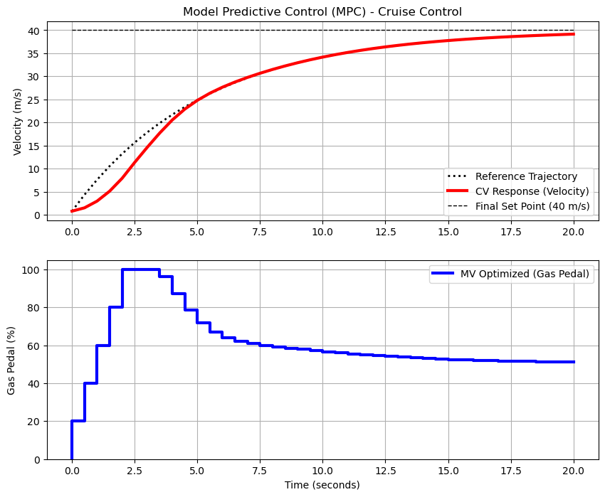

# Cruise Contol with MPC and GEKKO

'''
Solving MPC problem...
 ----------------------------------------------------------------
 APMonitor, Version 1.0.3
 APMonitor Optimization Suite
 ----------------------------------------------------------------
 
 
 --------- APM Model Size ------------
 
 Number of state variables:    360
 Number of total equations: -  320
 Number of slack variables: -  0
 ---------------------------------------
 Degrees of freedom       :    40
 
 **********************************************
 Dynamic Control with Interior Point Solver
 **********************************************
  
  
 Info: Exact Hessian

******************************************************************************
This program contains Ipopt, a library for large-scale nonlinear optimization.
 Ipopt is released as open source code under the Eclipse Public License (EPL).
         For more information visit http://projects.coin-or.org/Ipopt
******************************************************************************

This is Ipopt version 3.10.2, running with linear solver mumps.

Number of nonzeros in equality constraint Jacobian...:      837
Number of nonzeros in inequality constraint Jacobian.:        0
Number of nonzeros in Lagrangian Hessian.............:      160

Total number of variables............................:      360
                     variables with only lower bounds:        0
                variables with lower and upper bounds:       80
                     variables with only upper bounds:        0
Total number of equality constraints.................:      320
Total number of inequality constraints...............:        0
        inequality constraints with only lower bounds:        0
   inequality constraints with lower and upper bounds:        0
        inequality constraints with only upper bounds:        0

Number of objective function evaluations             = 9
Number of objective gradient evaluations             = 9
Number of equality constraint evaluations            = 9
Number of inequality constraint evaluations          = 0
Number of equality constraint Jacobian evaluations   = 9
Number of inequality constraint Jacobian evaluations = 0
Number of Lagrangian Hessian evaluations             = 8
Total CPU secs in IPOPT (w/o function evaluations)   =      0.022
Total CPU secs in NLP function evaluations           =      0.017

EXIT: Optimal Solution Found.

 The solution was found.

 The final value of the objective function is  2743.7977289855176
 
 ---------------------------------------------------
 Solver         :  IPOPT (v3.12)
 Solution time  :  0.0423 sec
 Objective      :  2743.797724185546
 Successful solution
 ---------------------------------------------------
 '''
